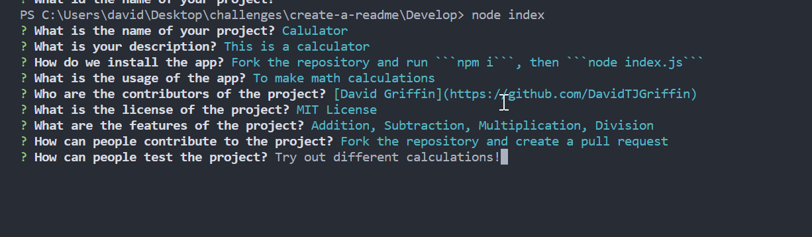

# Create a README.md 
  ## Description
 This is a command-line README.md file generator for you to create professional README.md files for your code projects. 
## Table of Contents

- [Installation](#installation)
- [Usage](#usage)
- [Credits](#credits)
- [License](#license)

## Installation
1. Fork this repository
2. Open terminal in Develop directory
3. First, Run:

	```npm install```
4. Then, Run:

	```node index```
5. Enter answers for the questions prompts 
6. Based on your answers, the README.md file will generated located at /Develop/README.md
7. Copy the README.md file or raw code and paste into your own project
## Usage
* Use this command-line README.md generator to stream-line the creation of professional and descriptive README.md files for your projects. 

## Credits
[David Griffin](https://github.com/DavidTJGriffin)
## License
MIT License

Copyright (c) 2022 David Griffin

Permission is hereby granted, free of charge, to any person obtaining a copy
of this software and associated documentation files (the "Software"), to deal
in the Software without restriction, including without limitation the rights
to use, copy, modify, merge, publish, distribute, sublicense, and/or sell
copies of the Software, and to permit persons to whom the Software is
furnished to do so, subject to the following conditions:

The above copyright notice and this permission notice shall be included in all
copies or substantial portions of the Software.

THE SOFTWARE IS PROVIDED "AS IS", WITHOUT WARRANTY OF ANY KIND, EXPRESS OR
IMPLIED, INCLUDING BUT NOT LIMITED TO THE WARRANTIES OF MERCHANTABILITY,
FITNESS FOR A PARTICULAR PURPOSE AND NONINFRINGEMENT. IN NO EVENT SHALL THE
AUTHORS OR COPYRIGHT HOLDERS BE LIABLE FOR ANY CLAIM, DAMAGES OR OTHER
LIABILITY, WHETHER IN AN ACTION OF CONTRACT, TORT OR OTHERWISE, ARISING FROM,
OUT OF OR IN CONNECTION WITH THE SOFTWARE OR THE USE OR OTHER DEALINGS IN THE
SOFTWARE.
## Features
* Command-line interactivity for input to generate file

## How to contribute
* Fork the repository and make changes, then do a pull request for me to review
## Tests
* Enter different data into the terminal to test different inputs and licenses. 
